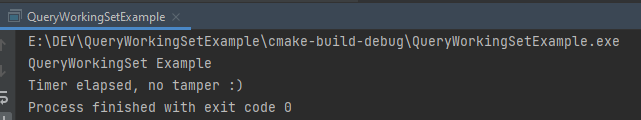
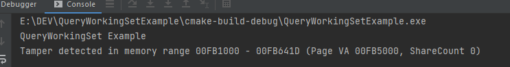

# QueryWorkingSet AntiTamper Example

Just an example of a well-known technique to detect memory tampering via Windows Working Sets.

Non-writable pages are being shared among processes that need it.
Once one process issue modify the protection of a page to write to it, the system will copy the page and serve the process its own copy.

A process can check his `.text` section (or any non writable section) by querying his Working Set (using QueryWorkingSet(Ex) API(s)) and checking the `Shared` and `ShareCount` members.

- Running without a debugger
  
  
- Running under a debugger (you need to place a breakpoint)
  
  
The page RVA in the screenshot above would be `0x5000`, once you load the build sample into you favorite disassemble you can notice that the page at RVA `0x5000` contains all the `main.c` code.

Have fun 🏴‍☠️